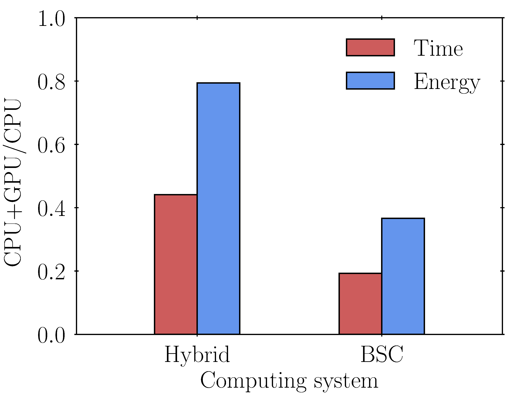
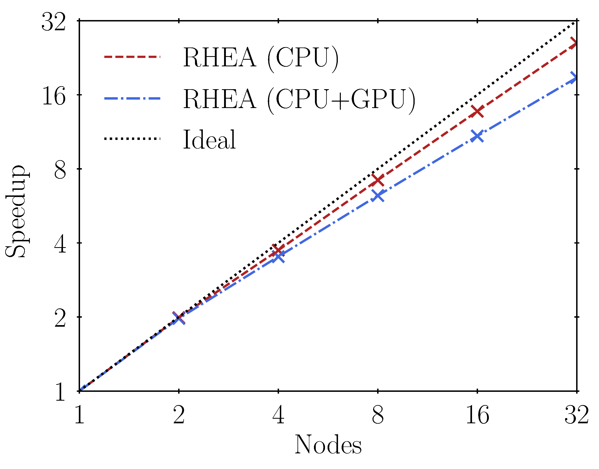
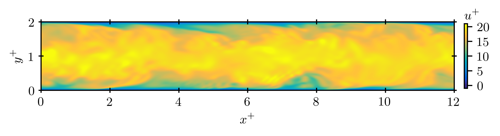

# Summary

# Statement of need

# Computational design

The computational performance of RHEA is depicted in Figure \autoref{fig:computational_performance} by carrying out (i) time- \& energy-to-solution, and (ii) strong scalability tests based on $100$ time iterations of the 3-D turbulent channel flow configuration described in the next section. In this regard, to assess the portability of RHEA to different computing systems, the performance tests have been performed on: (i) a local hybrid machine (results are referred to as Hybrid), and (ii) the Barcelona Supercomputer Center [@BSC] (results are indicated as BSC). The Hybrid machine is composed of a node with 1 AMD Ryzen 9 3900XT 12-core CPU and 2 NVIDIA Quadro RTX 4000 GPUs, while the BSC supercomputer contains a CPU-GPU cluster with 3 racks formed of 54 IBM POWER9 nodes, each containing 2 Witherspoons CPUs (20 cores of 3.1 GHz each), 4 Volta NVIDIA GPUs (16 GB each), and 6.4 TB of NVMe (Non-Volatile Memory).

# Application example
The ability of RHEA to easily configure computational flow problems and run them efficiently on top-tier supercomputing systems is demonstrated by simulating the canonical three-dimensional (3-D) turbulent channel flow problem [@Smits2011-A] on 2 nodes of the CTE POWER9 cluster of the Barcelona Supercomputing Center [@BSC]. The friction Reynolds number selected is $Re_{\tau} = u_{\tau} \delta / \nu = 180$, where $u_{\tau} = 1\thinspace\textrm{m/s}$ is the friction velocity, $\delta=1\thinspace\textrm{m}$ is the channel half-height, and $\nu = \mu / \rho$ is the kinematic viscosity of the fluid with $\mu$ the dynamic viscosity and $\rho = 1\thinspace\textrm{kg/m}^\textrm{3}$ the density. The Prandtl number of the problem is $Pr = c_p \mu/\kappa = 0.71$ with $c_p$ the isobaric specific heat capacity, and the Mach number is $Ma = u_b/\sqrt{\gamma P_b/\rho} = 0.3$ with $u_{b}$ and $P_b$ the bulk velocity and pressure, respectively, and $\gamma=1.4$ the heat capacity ratio. The mass flow rate in the streamwise direction is imposed through a body force equal to $\textbf{f}=\left[\tau_{w}/\delta,0,0\right]^{\intercal}$, where $\tau_{w}$ is the wall shear stress.

The computational domain is $4 \pi \delta \times 2\delta \times 4/3\pi \delta$ in the streamwise ($x$), wall-normal ($y$), and spanwise ($z$) directions, respectively. The streamwise and spanwise boundaries are set periodic, and no-slip conditions are imposed on the horizontal boundaries ($x$-$z$ planes). The grid is uniform in the streamwise and spanwise directions with resolutions in wall units equal to $\Delta x^{+} = 9$ and $\Delta z^{+} = 6$, and stretched toward the walls in the vertical direction with the first grid point at $y^{+} = y u_{\tau}/\nu =0.1$ and with sizes in the range $0.1 \lesssim \Delta y^{+} \lesssim 4$. This grid arrangement corresponds to a direct numerical simulation (DNS) of size $256 \times 128 \times 128$ grid points. The simulation strategy starts from a linear velocity profile with random fluctuations [@Nelson2017-A], which is advanced in time utilizing the KGP convection scheme [@Coppola2019-A] with $\textrm{CFL}=0.9$ to reach turbulent steady-state conditions after approximately $20$ flow-through-time (FTT) units; based on the bulk velocity $u_{b}$ and the length of the channel $L_x = 4\pi\delta$, a FTT is defined as $t_{b} = L_x/u_{b} \sim \delta/u_{\tau}$. Flow statistics are collected for roughly $30$ FTTs once steady-state conditions are achieved, and compared against reference results [@Moser1999-A].

![Comparison against reference results [@Moser1999-A] of the time-averaged streamwise velocity $u^+$ (left) and $\textrm{rms}$ velocity fluctuations $u_{\textrm{rms}}^{+}$, $v_{\textrm{rms}}^{+}$ and $w_{\textrm{rms}}^{+}$ (right) along the wall-normal direction $y^+$ in wall units.\label{fig:3d_turbulent_channel_flow_statistics}](u_plus_vs_y_plus.png)
![Comparison against reference results [@Moser1999-A] of the time-averaged streamwise velocity $u^+$ (left) and $\textrm{rms}$ velocity fluctuations $u_{\textrm{rms}}^{+}$, $v_{\textrm{rms}}^{+}$ and $w_{\textrm{rms}}^{+}$ (right) along the wall-normal direction $y^+$ in wall units.\label{fig:3d_turbulent_channel_flow_statistics}](uvw_rms_plus_vs_y_plus.png)

The time-averaged mean streamwise velocity $u^+$ and root-mean-squared ($\textrm{rms}$) velocity fluctuations $u_{\textrm{rms}}^{+}$, $v_{\textrm{rms}}^{+}$, $w_{\textrm{rms}}^{+}$ along the wall-normal direction $y^+$ in wall units provided by RHEA and compared to reference results [@Moser1999-A] are depicted in Figure \autoref{fig:3d_turbulent_channel_flow_statistics}. As shown in the figure, the results from RHEA accurately reproduce the first- and second-order turbulent flow statistics by (i) properly capturing the inner (viscous sublayer, buffer layer and and log-law region) and outer layers, and (ii) the turbulent flow fluctuations peaking around $y^+\approx 15$ for the streamwise velocity. Additionally, a snapshot of the instantaneous streamwise velocity in wall units $u^+$ on a $x^+$-$y^+$ slice is displayed in Figure \autoref{fig:3d_turbulent_channel_flow_contours} to provide qualitative information of the wall-bounded turbulence at $Re_\tau = 180$ computed by RHEA.

# Acknowledgements
This work is supported by the European Research Council (ERC) under the European Union’s Horizon Europe research and innovation programme (grant agreement No. 101040379 - SCRAMBLE), and the *Beatriz Galindo* programme (Distinguished Researcher, BGP18/00026) of the *Ministerio de Ciencia, Innovación y Universidades* (Spain).

# References
