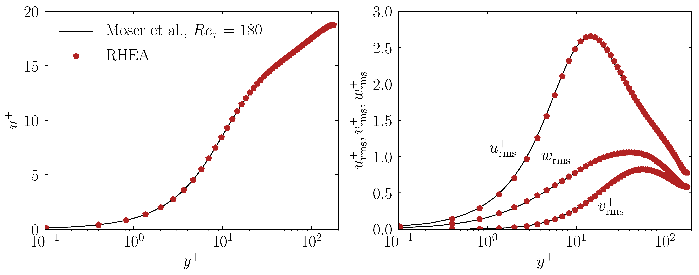
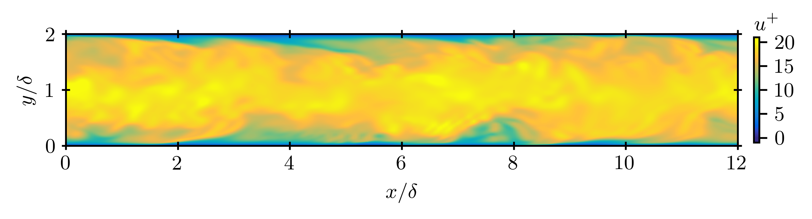

# Summary

The study of complex multiscale flows [@Groen2014-A], like for example the motion of small-scale turbulent eddies over large aerodynamic structures [@Jofre2022-A], microconfined high-pressure supercritical fluids for enhanced energy transfer [@Bernades2022-A], or hydrodynamic focusing of microorganisms in wall-bounded flows [@Palacios2022-A], greatly benefits from the combination of interconnected theoretical, computational and experimental approaches. This manifold methodology provides a robust framework to corroborate the phenomena observed, validate the modeling assumptions utilized, and facilitates the exploration of wider parameter spaces and extraction of more sophisticated insights. These analyses are typically encompassed within the field of Predictive Science & Engineering [@Njam2009-A], which has attracted attention in the Fluid Mechanics community and is expected to exponentially grow as computational studies transition from (mostly) physics simulations to active vectors for scientific discovery and technological innovation with the advent of Exascale computing [@Alowayyed2017-A]. In this regard, the computational flow solver presented aims at bridging the gap between studying complex multiscale flow problems and utilizing present and future state-of-the-art supercomputing systems in academic environments. The solver presented is named RHEA, which stands for *open-source **R**eproducible **H**ybrid-architecture flow solver **E**ngineered for **A**cademia*, and is inspired by the Titaness great Mother of the ancient Greek Gods, and goddess of female fertility, motherhood and generation. Her name was RHEA and means *flow* and *ease*, representing the eternal flow of time and generations with ease. RHEA is available as an open-source Git repository at https://gitlab.com/ProjectRHEA/flowsolverrhea.

# Statement of need

The computational study and optimization of multiscale flow problems, like for example turbulence, requires the utilization of powerful supercomputers. In particular, the computational cost of studying wall turbulence, in terms of total number of grid points $N$, by means of direct numerical simulation (DNS) and/or wall-modeled large eddy simulation (LES) strategies scales with the Reynolds number as $N \sim Re^{37/14}$ and $N \sim Re$ [@Choi2012-A], respectively. Therefore, flows at high Reynolds numbers require large computational meshes solved on substantial node counts. As a result, the meshes used to discretize the computational domain on which the equations of fluid motion are solved need to be partitioned (distributed) among parallel tasks such that each of these only holds a local portion of the global mesh. The local portion of each task is composed of a set of grid points that it owns, and a set of off-processor grid points (owned by remote processors) connected with their corresponding local grid points. This overlapped mesh partition is used to exchange data among nearest neighbors by means of message passage interface (MPI) [@MPI] instructions. In addition, present (and future) supercomputers are equipped with accelerators, like for example graphics processing units (GPU), interconnected with the central processing units (CPU) and the main memory at the node level. In this regard, the flow solver RHEA uses OpenACC [@OpenACC] pragmas to efficiently speedup the main kernels. This computational framework has been designed with the objective to facilitate the portability of the flow solver from small- and mid-size workstations to top-tier supercomputers, while maintaining notable levels of computational performance. 

There is only a handful of full-fledged accelerated open-source flow solvers available in the literature. Some selected examples for compressible flows include (i) popular multi-purpose open-source packages for simulation [@Nektar] and design [@SU2], (ii) OpenSBLI [@OpenSBLI] dedicated to the automated derivation of finite-difference solvers for hybrid (CPU-GPU) architectures based on a Python framework, (iii) HTR [@HTR] constructed from the task-based Legion programming paradigm [@Legion] and targeted to simulate hypersonic reacting flows, and (iv) STREAmS [@STREAmS] resulting from the extension of a CPU-based solver to run on multi-GPU clusters and focused on supersonic ideal-gas flows. In this regard, RHEA has been designed and developed with the aim to cover this void for the academic community, specifically focusing on (i) ease of use, (ii) generality of flow problems that can be studied in terms of thermodynamic and flow regimes, (iii) rapid portability to different architectures, (iv) computational performance, and (v) reproducibility through uploading to the repository the parameters and input files required to regenerate the data from simulations.

# Computational design

RHEA solves the three-dimensional (3-D) compressible equations of fluid motion utilizing non-uniform Cartesian second-order discretizations [@Moin2010-B] in combination with kinetic energy preserving [@Coppola2019-A] convection schemes, or different Harten-Lax-van-Leer-type (HLL) Riemann solvers [@Toro2009-B], and uses explicit Runge-Kutta methods [@Gottlieb2001-A] for time integration. The set of conservation equations is closed by means of ideal- or real-gas thermodynamics to target, respectively, subcritical and supercritical fluid regimes [@Jofre2021-A]. The solver can be utilized for a wide range of fluid mechanics problems as it allows (i) to easily overwrite most high-level kernels to set, for example, specific initial conditions and source terms, and (ii) select between Dirichlet, Neumann, periodic, and subsonic & supersonic inflow-outflow [@Poinsot1992-A] boundary conditions. RHEA is written in C++ [@Stroustrup2013-B], using object-oriented programming, utilizes YAML [@YAML] and HDF5 [@HDF5] for input/output operations, and targets hybrid (CPU-GPU) supercomputing architectures based on a state-of-the-art parallel and scalable MPI [@MPI] + OpenACC [@OpenACC] accelerated (managed-memory) computational framework.

The computational performance of RHEA is depicted in \autoref{fig:figure_1} by carrying out (i) time- \& energy-to-solution, and (ii) strong scalability tests based on $100$ time iterations of the 3-D turbulent channel flow configuration (different mesh) described in the next section. In this regard, to assess the portability of RHEA to different computing systems, the performance tests have been performed on (i) a local hybrid machine (results are referred to as Hybrid) and (ii) the Barcelona Supercomputer Center [@BSC] (results are indicated as BSC) without performing any particular tuning of the solver. The Hybrid machine is composed of a node with 1 AMD Ryzen 9 3900XT 12-core CPU and 2 NVIDIA Quadro RTX 4000 GPUs, while the BSC supercomputer contains a CPU-GPU cluster with 3 racks formed of 54 IBM POWER9 nodes, each containing 2 Witherspoons CPUs (20 cores of 3.1 GHz each), 4 Volta NVIDIA GPUs (16 GB each), and 6.4 TB of NVMe (Non-Volatile Memory). Four main observations can be inferred from the results. First, focusing on the time-to-solution when using CPUs+GPUs with respect to only CPUs, the solver is accelerated approximately $2.5\times$ and $5\times$ on the Hybrid and BSC computers. Second, running on CPUs+GPUs consume more power (Joules per second, i.e., Watts) than on CPUs. However, the energy-to-solution (Joules) is reduced by factors of roughly $1.3$ and $2.5$ on the Hybrid and BSC systems, respectively. Third, on BSC for a fixed-problem size, the solver presents similar speedups in terms of strong scalability when running on CPUs and CPUs+GPUs up to 32 nodes (640 cores and 128 GPUs) until communication overheads become important in relative value; at 32 nodes, each processor contains approximately 325000 grid points. Fourth, maintaining the same ratio of problem size to number of nodes, RHEA is able to preserve weak scalability efficiency above 90\% on CPUs and CPUs+GPUs up to 32 nodes on BSC.

# Application example

The ability of RHEA to easily configure computational flow problems and run them efficiently on powerful supercomputing systems is demonstrated by simulating the canonical 3-D turbulent channel flow problem [@Smits2011-A] on 2 nodes of the CTE POWER9 cluster of the Barcelona Supercomputing Center [@BSC]. The friction Reynolds number selected is $Re_\tau = u_\tau \delta / \nu = 180$, where $u_\tau = 1$ m/s is the friction velocity, $\delta=1$ m is the channel half-height, and $\nu = \mu / \rho$ is the kinematic viscosity of the fluid with $\mu$ the dynamic viscosity and $\rho = 1$ kg/m³ the density. The Prandtl number of the problem is $Pr = c_p \mu/\kappa = 0.71$ with $c_p$ the isobaric specific heat capacity, and the Mach number is $Ma = u_b/\sqrt{\gamma P_b/\rho} = 0.3$ with $u_{b}$ and $P_b$ the bulk velocity and pressure, respectively, and $\gamma=1.4$ the heat capacity ratio. The mass flow rate in the streamwise direction is imposed through a body force equal to $\textbf{f}=\left[\tau_{w}/\delta,0,0\right]^{\intercal}$, where $\tau_{w}$ is the wall shear stress.

The computational domain is $4 \pi \delta \times 2\delta \times 4/3\pi \delta$ in the streamwise ($x$), wall-normal ($y$), and spanwise ($z$) directions, respectively. The streamwise and spanwise boundaries are set periodic, and no-slip conditions are imposed on the horizontal boundaries ($x$-$z$ planes). The grid is uniform in the streamwise and spanwise directions with resolutions in wall units equal to $\Delta x^{+} = 9$ and $\Delta z^{+} = 6$, and stretched toward the walls in the vertical direction with the first grid point at $y^{+} = y u_{\tau}/\nu =0.1$ and with sizes in the range $0.2 \lesssim \Delta y^{+} \lesssim 4$. This grid arrangement corresponds to a DNS of size $256 \times 128 \times 128$ grid points. The simulation strategy starts from a linear velocity profile with random fluctuations [@Nelson2017-A], which is advanced in time utilizing the KGP convection scheme [@Coppola2019-A] with $\textrm{CFL}=0.9$ to reach turbulent steady-state conditions after approximately $20$ flow-through-time (FTT) units; based on the bulk velocity $u_{b}$ and the length of the channel $L_x = 4\pi\delta$, a FTT is defined as $t_{b} = L_x/u_{b} \sim \delta/u_{\tau}$. Flow statistics are collected for roughly $30$ FTTs once steady-state conditions are achieved, and compared against reference results [@Moser1999-A].

The time-averaged mean streamwise velocity $u^+$ and root-mean-squared ($rms$) velocity fluctuations $u_{rms}^{+}$, $v_{rms}^{+}$, $w_{rms}^{+}$ along the wall-normal direction $y^+$ in wall units provided by RHEA and compared to reference results [@Moser1999-A] are depicted in \autoref{fig:figure_2}. As shown in the figure, the results from RHEA accurately reproduce the first- and second-order flow statistics by (i) properly capturing the inner (viscous sublayer, buffer layer and and log-law region) and outer layers, and (ii) the flow fluctuations peaking around $y^+\approx 15$ for the streamwise velocity. Additionally, a snapshot of the instantaneous streamwise velocity in wall units $u^+$ on a $x^+$-$y^+$ slice is displayed in \autoref{fig:figure_3} to provide qualitative information of the wall-bounded turbulence computed by RHEA.

# Acknowledgements

This work is supported by the European Research Council (ERC) under the European Union’s Horizon Europe research and innovation programme (grant agreement No. 101040379 - SCRAMBLE), and the *Beatriz Galindo* programme (Distinguished Researcher, BGP18/00026) of the *Ministerio de Ciencia, Innovación y Universidades* (Spain).

# References
